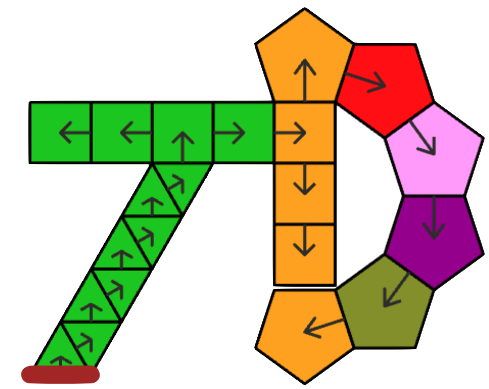

# TileDrive (td) 

This is a developing project that hopes to create a introductory environment to play with shapes, patterns, and eventually coding. This is the first version-controlled tile environment. The previous environments 
TileLand and PolygonR&D (early 2000's) were vi or emacs maintained :)

Jump into tiling
* [TileDrive](./TileDrive.html) is the main link to the main application.
* An [Introduction](./TDIntro.html) to the world of tiledriving is presented with many other linked documents that address some of the details and subtleties of this tiling world.
* A [summary](./TileDriveCoding.html#summary) of the instructions (both foundation and preprocessing) can be used to get a sense for computations and programming.

## Description
The Introduction is the best place to see what this project is about. 
The main difference between the previous work is that there is focus on a tree structure that will hopefully allow for easier immediate editting of patterns.  This new direction should lead to a more natural embellishment of existing patterns and hopefully ease connecting patterns with processing.

This version will promote simple code trees (non-looping non-conditional code) that can be cut and pasted. Simple text promoted in this new version with single character tokens. 
* [tileland](https://jimmorey.com/tl/tileland.html)
* [PolygonR&D](https://jimmorey.com/legacy/legacy.html)

## Details I'm thinking about

* future directions:
    * adding condition behaviour to the preprocessor language
        * ?{colour\|#}{True:[blah]\|A}{False:[blah]\|A}
    * adding a TileManager interface that focuses on helping explore and connecting outcomes with preprocessor code. This will probably include a reversable / partial execution tools
        * a simple version called [TDSlim](./TDSlim.html) was build for use with my limited R36S (which actually turned out to be a cheaper knock-off but still worked) and a wired keyboard. [demo](https://www.youtube.com/watch?v=Y2YO72a_l3g)

* bugs:
    * a current unsolved issue relates to chunking tiles in [Unwind](./Unwind.html) that I only have one problem case.  This is a low priority currently.

## Authors
Jim Morey 

## Version History
* 1.0 - works